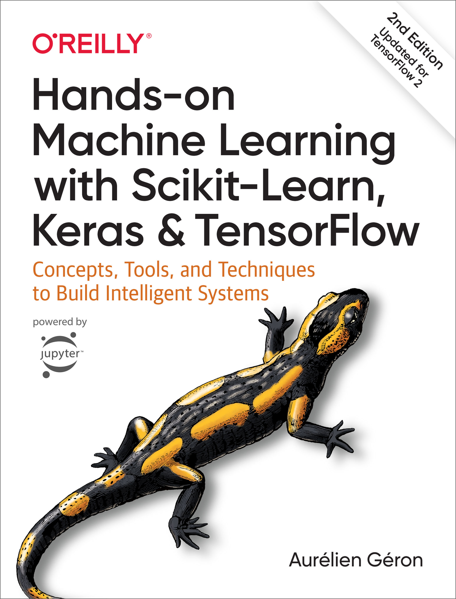

This project was completed in partial fulfillment of the requirement for EN.601.509(50) advised by Dr. Joshua Vogelstein 

# Introduction

The purpose of this assignment was to demonstrate programming language competency and comprehensive understanding of scikit learn API in various bioinformatic applications. Coding practicals were followed as instructed in *Hands-On Machine Learning with Scikit-Learn, Keras, and TensorFlow: Concepts, Tools, and Techniques to Build Intelligent Systems 2nd Edition*, and shown in Jupyter notebook. Additionally contained in this repository are study notes, book equations, and helpful compilations of coding examples on numpy, pandas, and matplotlib.

# Derivated Projects

Following short projects are derived from the use of scikit-learn API (latest first).

1. <a href='https://github.com/jshin13/Alzheimers_Disease_prediction_JHU'>Alzheimer's Disease genenic risk factor estimation from genetic variant fingerprints</a>
2. <a href='https://github.com/jshin13/BIOF509_FINAL_PRJ/blob/master/final-project.ipynb'>Classification of genetic mutation from word-based clinical evidence</a>
3. <a href='https://github.com/jshin13/BIOF399_FINAL_PRJ/blob/master/BIOF399_FINAL_PRJ.ipynb'>HIV status prediction from quantitative antibody profiles that consists of 11 antigen panels</a>

# Content Table

I. The Fundamentals of Machine Learning

1. The Machine Learning Landscape
2. End-to-End Machine Learning Project
3. Classification
4. Training Models
5. Support Vector Machines
6. Decision Trees
7. Ensemble Learning and Random Forests
8. Dimensionality Reduction
9. Unsupervised Learning Techniques

II. Neural Networks and Deep Learning

10. Introduction to Artificial Neural Networks with Keras
11. Training Deep Neural Networks
12. Custom Models and Training with TensorFlow
13. Loading and Preprocessing Data with TensorFlow
14. Deep Computer Vision Using Convolutional Neural Networks
15. Processing Sequences Using RNNs and CNNs
16. Natural Language Processing with RNNs and Attention
17. Representation Learning and Generative Learning Using Autoencoders and GANs
18. Reinforcement Learning
19. Training and Deploying TensorFlow Models at Scale

